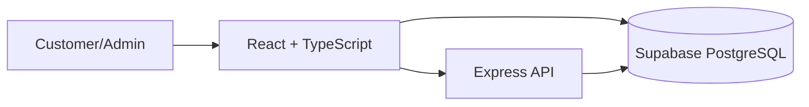

# WOW Cookies 🍪

A full-stack e-commerce platform built for a cookie business, featuring personalized product recommendations, recommendation analytics, customer management, and admin operations.

The project goes beyond a traditional online store by measuring whether recommendations actually influence customer behavior and purchasing decisions.

---

## 🚀 Live Demo [https://wow-cookies.vercel.app/]


---

## 📸 Preview

### Home Page


### Recommendation Section


### Admin Dashboard

#### Analytics Dashboard


#### Product Management


#### Order Management


#### Offers Management


---

## 🎯 Key Features

### Customer Experience

* User authentication with Email OTP and Google OAuth
* Product catalog and detailed product pages
* Shopping cart and checkout flow
* Product ratings and reviews
* Offers and discounts
* Mood-based browsing experience
* Responsive Arabic-first UI

### Personalized Recommendation Engine

* Behavioral recommendation system
* Category affinity scoring
* Session-aware recommendations
* Cold-start handling for new users
* Popularity, freshness, rating, novelty, and diversity signals
* Explainable recommendation reasons
* Recommendation confidence scoring

### Recommendation Analytics

Track recommendation performance through:

* Recommendation impressions
* Recommendation clicks
* Recommendation purchases
* Click Through Rate (CTR)
* Conversion Rate
* Purchase Rate

This allows recommendations to be evaluated using measurable business metrics rather than assumptions.

### Admin Dashboard

* Product management
* Order management
* Offer management
* Customer analytics
* Revenue analytics
* Recommendation performance analytics

---

## 🧠 Recommendation System

The recommendation engine uses a weighted scoring model that combines multiple signals:

| Signal            | Purpose                               |
| ----------------- | ------------------------------------- |
| User Behavior     | Learn customer interests              |
| Category Affinity | Identify preferred product categories |
| Popularity        | Recommend trending products           |
| Rating            | Promote highly rated products         |
| Freshness         | Surface newer products                |
| Novelty           | Reduce repetition                     |
| Diversity         | Increase recommendation variety       |
| Session Activity  | Adapt to current browsing behavior    |

Unlike black-box systems, recommendations are explainable and transparent.

Each recommendation includes:

* Recommendation type
* Recommendation reason
* Confidence score

---

## 📊 Analytics Dashboard

The analytics system measures business impact through:

### Business Metrics

* Revenue
* Orders
* Average Order Value
* Active Customers
* Returning Customers

### Product Metrics

* Most Viewed Products
* Most Added-To-Cart Products
* Most Purchased Products
* Highest Rated Products

### Recommendation Metrics

* Recommendation Impressions
* Recommendation Clicks
* Recommendation Purchases
* CTR
* Conversion Rate
* Purchase Rate

---

## 🏗️ Architecture



---

## 🛠️ Tech Stack

### Frontend

* React 19
* TypeScript
* Vite
* React Router
* Zustand
* Bootstrap

### Backend

* Node.js
* Express

### Database & Services

* Supabase PostgreSQL
* Supabase Auth
* Supabase Storage

### Analytics & Visualization

* Recharts

---

## ⚙️ Installation

### Clone Repository

```bash
git clone <repository-url>
cd WOW-blog
```

### Install Dependencies

```bash
npm install
```

### Frontend Environment

```env
VITE_SUPABASE_URL=
VITE_SUPABASE_PUBLISHABLE_KEY=
VITE_RECOMMENDATION_API_URL=http://localhost:4000
```

### Run Frontend

```bash
npm run dev
```

### Backend

```bash
cd backend
npm install
npm run dev
```

---

## 📂 Project Structure

```text
src/
├── components/
├── features/
├── hooks/
├── pages/
├── services/
├── stores/
├── utils/

backend/
├── recommendation.js
├── recommendation-explainer.js
├── diversity.js
└── server.js
```

---

## 💡 Engineering Highlights

### Explainable Recommendations

Recommendations are not only generated but also explained to users through recommendation reasons and confidence scores.

### Data-Driven Personalization

Every recommendation can be measured using clicks, purchases, CTR, and conversion metrics.

### Separation of Concerns

Recommendation logic is isolated inside a dedicated backend service, allowing independent development and future scalability.

---

## 🔮 Future Improvements

* Collaborative Filtering
* A/B Testing for recommendation strategies
* Customer segmentation
* Inventory-aware recommendations
* Online payment integration
* Automated testing
* CI/CD pipeline

