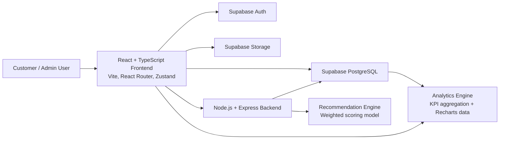
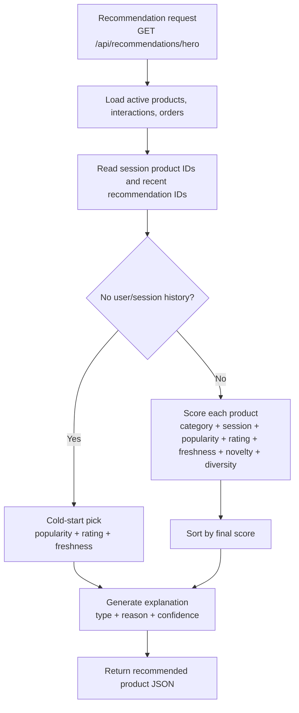
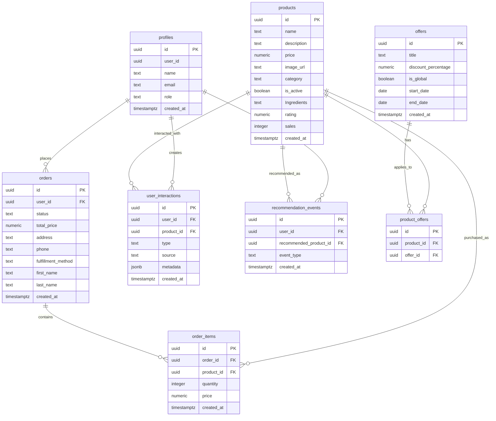

# WOW Cookies

[](https://react.dev/)
[](https://www.typescriptlang.org/)
[](https://vite.dev/)
[](https://supabase.com/)
[](https://expressjs.com/)

WOW Cookies is an Arabic-first, full-stack e-commerce platform for a cookie business, built to demonstrate more than product browsing and checkout. It combines a customer storefront, role-based admin operations, a behavioral recommendation engine, explainable recommendation copy, and a recommendation analytics dashboard that measures whether personalization is actually creating business value.

The project solves a real problem for small food businesses: product discovery, offers, order handling, and customer demand signals are often scattered across social media, manual messages, and spreadsheets. WOW Cookies turns that workflow into a data-aware ordering platform where every view, click, add-to-cart action, recommendation impression, recommendation click, and recommendation-driven purchase can become an input for better merchandising decisions.

What makes it different from a typical e-commerce website is the feedback loop. The storefront is not only a catalog; it collects behavioral signals, sends them to a dedicated recommendation service, explains why a product was suggested, and exposes admin-facing analytics for recommendation performance, revenue, orders, customers, and products.

## Project Overview

| Area | What it does |
| --- | --- |
| Personalized Recommendation Engine | Scores active products using user behavior, session behavior, global popularity, rating, freshness, novelty, and diversity signals. |
| Explainable Recommendations | Returns a recommendation reason, recommendation type, and confidence score so the customer sees why a product was suggested. |
| Recommendation Analytics | Tracks impressions, clicks, and purchases from recommendations, then calculates CTR, conversion rate, and purchase rate. |
| Business Intelligence Dashboard | Gives admins KPI cards and Recharts visualizations for revenue, orders, customers, products, and recommendation performance. |
| Customer Experience | Supports authentication, product browsing, offers, cart management, checkout, ratings, mood-based browsing, and a cookie wheel interaction. |
| Admin Management | Provides protected admin routes for product CRUD, offer management, order status updates, and analytics. |

## Key Features

### Customer Features

- Supabase authentication with email OTP and Google OAuth.
- Arabic storefront with product catalog, product details, product ratings, offers, and responsive layouts.
- Shopping cart built with Zustand and derived pricing helpers.
- Checkout with delivery and pickup flows.
- Order creation with order item insertion and rollback if item creation fails.
- Personalized home-page recommendation card.
- Mood-based product navigation through `/mood/:mood`.
- Cookie wheel route for a playful discovery experience.
- Interaction tracking for product views, product clicks, and add-to-cart actions.

### Recommendation System

- Weighted behavioral scoring for product recommendations.
- Category affinity from user interactions and historical orders.
- Session-aware recommendations from recently viewed or interacted products.
- Cold-start handling through trending/popularity, rating, and freshness signals.
- Popularity scoring from global user interactions and order items.
- Freshness scoring for newer products.
- Novelty scoring to reduce repeated recommendations for products already seen or purchased.
- Diversity scoring to penalize repeated categories and recently recommended products.
- Confidence scoring from the final recommendation score.
- Explainable recommendation output with recommendation type and human-readable reason.

Partially implemented: the code includes a `similar_users` recommendation type as a fallback label, but there is no collaborative filtering model yet. Collaborative filtering is listed under future improvements rather than as a completed feature.

### Analytics System

- Recommendation impression tracking through `recommendation_events` with `event_type = shown`.
- Recommendation click tracking through `event_type = clicked`.
- Recommendation purchase tracking through `event_type = purchased`.
- CTR measurement.
- Conversion rate measurement.
- Purchase rate measurement.
- Top recommended products by event count.
- Recommendation performance over time with impressions, clicks, and purchases.
- Product analytics for views, add-to-cart events, purchases, and ratings.

### Admin Dashboard

- Role-based admin route protection using `profiles.role = admin`.
- Product management: create, update, delete, and toggle active products.
- Order management: list orders with nested order items and update order status.
- Offer management: global offers and product-specific offers through `offers` and `product_offers`.
- Revenue analytics.
- Order analytics.
- Customer analytics.
- Product analytics.
- Recommendation performance analytics.

## Architecture



### System Flow

1. A customer browses products, clicks product cards, adds products to the cart, or interacts with a recommendation.
2. The frontend writes behavioral signals to Supabase tables such as `user_interactions` and `recommendation_events`.
3. The recommendation service reads products, global interactions, user interactions, order items, and session signals.
4. The scoring model selects a product and returns the product, score, reasons, recommendation type, and confidence.
5. The customer sees an explainable recommendation card on the home page.
6. Admin analytics aggregate orders, products, interactions, profiles, and recommendation events into business KPIs and charts.

## Recommendation Algorithm

The recommendation backend lives in `backend/src/recommendation.js` and is served by `backend/src/server.js`.

### Inputs

| Signal | Source | How it is used |
| --- | --- | --- |
| Views | `user_interactions.type = view` | Builds behavioral history and category affinity. |
| Clicks | `user_interactions.type = click` | Stronger product interest signal than a passive view. |
| Add To Cart | `user_interactions.type = add_to_cart` | High-intent behavior with the strongest interaction weight. |
| Purchases | `order_items` joined through `orders` for user history | Strengthens category affinity and global popularity. |
| Ratings | `products.rating` | Boosts highly rated products. |
| Session Signals | Query parameter `session_product_id` from session storage | Adapts recommendations to the current browsing session. |
| Recent Recommendations | Query parameter `recent_recommended_id` from session storage | Reduces immediate repetition and supports diversity. |

### Scoring Logic

| Component | Implementation detail |
| --- | --- |
| Category Affinity | Learns preferred categories from the user's interactions and orders. |
| Session Signals | Scores categories from products touched during the current browser session. |
| Popularity | Aggregates global interactions and order items for active products. |
| Freshness | Gives newer products a decaying boost over a 120-day window. |
| Novelty | Gives a lower score to products the user has already interacted with or purchased. |
| Diversity | Penalizes repeated product IDs, repeated categories, and similar product names using token similarity. |
| Rating | Normalizes product ratings to a 0-1 score. |
| Cold Start | Uses popularity, rating, and freshness when no user or session history exists. |

The current model is a deterministic weighted scoring model, not a machine learning model. That is intentional for this portfolio version: it is transparent, explainable, easy to debug, and directly connected to measurable e-commerce behavior.

### Recommendation Flow



## Analytics Metrics

Recommendation analytics are calculated in `src/services/analytics/admin-analytics.service.ts` from `recommendation_events`.

| Metric | Formula | Meaning |
| --- | --- | --- |
| Recommendation Impressions | Count of `shown` events | How many times a recommendation was displayed to authenticated users. |
| Recommendation Clicks | Count of `clicked` events | How many times users clicked a recommended product. |
| Recommendation Purchases | Count of `purchased` events | How many completed orders included recently recommended products. |
| CTR | `Clicks / Impressions * 100` | Measures whether recommendations are attractive enough to click. |
| Conversion Rate | `Purchases / Clicks * 100` | Measures whether clicked recommendations become purchases. |
| Purchase Rate | `Purchases / Impressions * 100` | Measures end-to-end recommendation impact from display to purchase. |

The admin KPI cards also render Arabic helper text and the actual formula with live values, for example:

```text
Clicks (25) / Impressions (200) * 100
```

## Database Design

The app integrates with Supabase PostgreSQL. The committed code defines TypeScript models and service-level queries, but SQL migration files are not currently committed in `database/`. The ERD below reflects the schema used by the application code.



## Tech Stack

| Layer | Technologies |
| --- | --- |
| Frontend | React 19, TypeScript, Vite, React Router |
| State Management | Zustand |
| Styling | Bootstrap 5, Bootstrap Icons, Tailwind CSS package/plugin, custom CSS |
| Backend | Node.js, Express |
| Database | Supabase PostgreSQL |
| Auth | Supabase Auth with email OTP and Google OAuth |
| Storage | Supabase Storage for product images |
| Visualization | Recharts |
| Data Access | `@supabase/supabase-js`, `pg` for direct PostgreSQL backend mode |
| Deployment Config | Vercel SPA rewrites through `vercel.json` |

## Screenshots

Add screenshots after capturing the deployed or local UI. Suggested file paths:

### Home Page


### Recommendation Section


### Analytics Dashboard


Recommended capture flow:

1. Create `docs/screenshots/`.
2. Run the frontend locally with `npm run dev`.
3. Capture the home page, recommendation card, product catalog, cart/checkout, and admin analytics.
4. Save files using the paths above so GitHub renders them automatically.

## Installation

### Prerequisites

- Node.js 20 or newer recommended.
- npm.
- A Supabase project with Auth, PostgreSQL tables, and Storage configured.

### 1. Clone the Repository

```bash
git clone <repository-url>
cd WOW-blog
```

### 2. Install Frontend Dependencies

```bash
npm install
```

### 3. Configure Frontend Environment

Create `.env` in the project root:

```env
VITE_SUPABASE_URL=https://your-project.supabase.co
VITE_SUPABASE_PUBLISHABLE_KEY=your-supabase-publishable-key
VITE_RECOMMENDATION_API_URL=http://localhost:4000
```

`VITE_RECOMMENDATION_API_URL` is optional for the UI to load, but required for the external recommendation backend. If it is missing or the backend is unavailable, the home page falls back to a local explanation for a fallback product.

### 4. Run the Frontend

```bash
npm run dev
```

The frontend runs on:

```text
http://localhost:5173
```

### 5. Install Backend Dependencies

```bash
cd backend
npm install
```

### 6. Configure Backend Environment

Create `backend/.env`:

```env
PORT=4000
FRONTEND_ORIGIN=http://localhost:5173
DATABASE_URL=postgresql://postgres:<password>@<host>:5432/postgres?sslmode=require
SUPABASE_URL=https://your-project.supabase.co
SUPABASE_SERVICE_ROLE_KEY=your-supabase-service-role-key
```

The backend supports two data access modes:

- `DATABASE_URL`: direct PostgreSQL mode through `pg`.
- `SUPABASE_URL` + `SUPABASE_SERVICE_ROLE_KEY`: Supabase client fallback mode when `DATABASE_URL` is not provided.

### 7. Run the Backend

```bash
npm run dev
```

The backend runs on:

```text
http://localhost:4000
```

Health check:

```bash
curl http://localhost:4000/health
```

### 8. Database Setup

The code expects these Supabase tables:

- `profiles`
- `products`
- `orders`
- `order_items`
- `user_interactions`
- `recommendation_events`
- `offers`
- `product_offers`

SQL migrations are not currently committed, so a new environment should create tables that match the ERD and TypeScript models in `src/types/database.types.ts`. Configure Supabase Row Level Security policies so authenticated users can read public storefront data and create their own interaction, recommendation, cart, and order events, while admin-only mutations are protected by `profiles.role`.

## Environment Variables

### Root `.env.example`

```env
VITE_SUPABASE_URL=https://your-project.supabase.co
VITE_SUPABASE_PUBLISHABLE_KEY=your-supabase-publishable-key
VITE_RECOMMENDATION_API_URL=http://localhost:4000
```

### Backend `.env.example`

```env
PORT=4000
FRONTEND_ORIGIN=http://localhost:5173
DATABASE_URL=postgresql://postgres:<password>@<host>:5432/postgres?sslmode=require
SUPABASE_URL=https://your-project.supabase.co
SUPABASE_SERVICE_ROLE_KEY=your-supabase-service-role-key
```

Never expose `SUPABASE_SERVICE_ROLE_KEY` in the frontend. It belongs only in the backend environment.

## API Endpoints

### Recommendation Backend

| Method | Endpoint | Query Parameters | Description |
| --- | --- | --- | --- |
| `GET` | `/health` | None | Returns backend health, service name, and active data mode. |
| `GET` | `/api/recommendations/hero` | `user_id`, `session_product_id`, `recent_recommended_id` | Returns one recommended product, score, reason signals, explanation, confidence, generated timestamp, and backend mode. |

Example:

```bash
curl "http://localhost:4000/api/recommendations/hero?user_id=<user-id>&session_product_id=<product-id>"
```

The rest of the application uses Supabase directly from frontend services for authentication, products, offers, orders, interactions, recommendation events, and analytics queries.

## Project Structure

```text
WOW-blog/
|-- backend/
|   |-- src/
|   |   |-- diversity.js
|   |   |-- recommendation.js
|   |   |-- recommendation-explainer.js
|   |   `-- server.js
|   |-- package.json
|   `-- README.md
|-- public/
|-- src/
|   |-- components/
|   |-- components/analytics/
|   |-- components/cart/
|   |-- components/recommendation/
|   |-- features/admin/
|   |-- hooks/
|   |-- layouts/
|   |-- lib/
|   |-- pages/
|   |-- services/
|   |-- stores/
|   |-- types/
|   `-- utils/
|-- package.json
|-- vite.config.ts
`-- vercel.json
```

## Engineering Highlights

### Why the Recommendation Engine Is Interesting

The recommendation engine is transparent and production-minded. Instead of hiding behavior behind an opaque model, it decomposes the recommendation into measurable signals: category affinity, session intent, popularity, rating, freshness, novelty, and diversity. That makes the system explainable to users, inspectable by engineers, and easier for business stakeholders to reason about.

### Why the Analytics Platform Matters

The analytics dashboard closes the loop between personalization and business outcomes. It does not stop at "a recommendation was shown"; it measures whether the recommendation was clicked and whether it eventually contributed to a purchase. This is the difference between a decorative AI feature and an accountable product system.

### Engineering Decisions

- Split recommendation logic into a dedicated Express backend so scoring can evolve independently from the storefront.
- Support both direct PostgreSQL access and Supabase client access in the backend.
- Keep recommendation events separate from general product interactions to make recommendation KPIs clean.
- Use reusable frontend service modules instead of embedding Supabase queries directly in UI components.
- Use role-based admin routing so business operations are separated from customer flows.
- Build analytics cards from typed KPI data so labels, values, helper text, formulas, and visual accents stay reusable.

### Business Impact Measurement

WOW Cookies measures impact through concrete operational and recommendation metrics:

- Revenue and average order value.
- Total orders and order status.
- Active and returning customers.
- Most viewed products.
- Most added-to-cart products.
- Most purchased products.
- Highest-rated products.
- Recommendation impressions, clicks, purchases, CTR, conversion rate, and purchase rate.

## Current Limitations

- SQL migrations/schema files are not committed yet; schema is inferred from TypeScript models and Supabase queries.
- Collaborative filtering is not implemented yet.
- The rating service currently updates a product-level rating value rather than storing per-user rating rows.
- Recommendation tracking only inserts events for authenticated users.
- Payment gateway integration is not implemented.
- Automated test coverage is not currently present in the repository.
- Several existing Arabic UI files appear to have text encoding issues in source display and should be normalized to UTF-8.

## Future Improvements

- Collaborative filtering based on user-product interaction matrices.
- Hybrid recommendation models that combine content-based, behavioral, and collaborative signals.
- A/B testing for recommendation strategies and UI placement.
- Recommendation feedback loops such as "not interested" or "show me more like this".
- Advanced customer segmentation by purchase frequency, category preference, and order value.
- Per-user product ratings and review history.
- Inventory tracking and stock-aware recommendations.
- Database migrations and seed scripts.
- CI checks for linting, type checking, build, and service-level tests.
- Payment integration for online checkout.

## Author

Built as a portfolio-grade full-stack project for demonstrating software engineering, recommendation systems, analytics, and product-focused development.

**Developer:** Your Name  
**GitHub:** [github.com/your-username](https://github.com/your-username)  
**LinkedIn:** [linkedin.com/in/your-profile](https://www.linkedin.com/in/your-profile)
